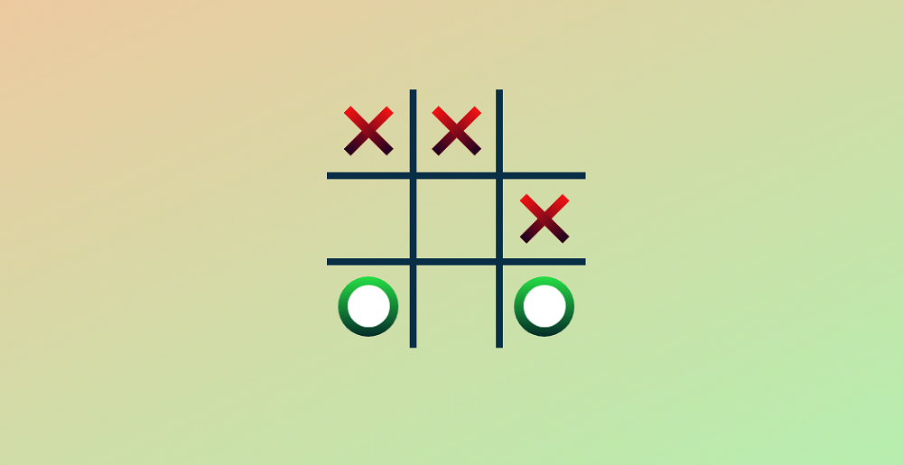
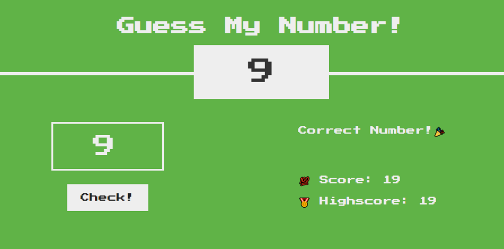
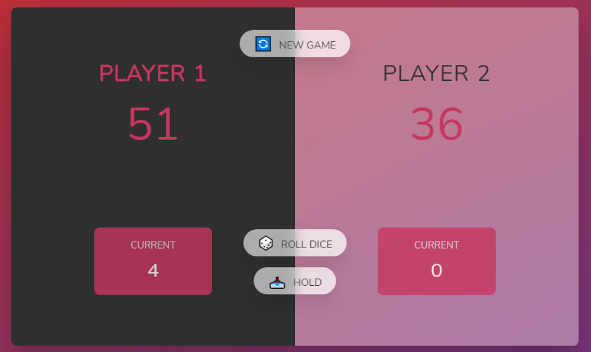

# 🎮 ZsNinja - Online Gaming Site

Welcome to **ZsNinja**, your online destination to play popular mini-games like Tic Tac Toe, Guess My Number, and Pig (Roll the Dice). Enjoy a fun and interactive gaming experience right in your browser!

---

## 🚀 Features

- **Multiple Trending Games**:  
  - Tic Tac Toe ❌⭕  
  - Guess My Number 🤔  
  - Pig (Roll the Dice) 🎲  

- **Interactive Modals** with clear game instructions and play links  
- **Screenshot Gallery** showcasing game previews  
- **Contact Form** to reach out for feedback or inquiries  

---

## 🖼️ Screenshots

  
  
  

---

## 📂 Project Structure

- `index.html` - Main landing page with navigation, game listings, gallery, and contact form  
- `style.css` - Styling for layout, colors, and responsive design  
- `script.js` - JavaScript for dynamic background, modal controls, and game instructions  
- `images/` - Folder containing all game images and screenshots  
- `tic-tac-game/`, `guess-game/`, `dice-game/` - Game folders with HTML and assets for each game  

---

## ⚙️ How to Run Locally

1. Clone or download this repository  
2. Open `index.html` in your preferred browser  
3. Click on any game image or name to see instructions and start playing  

---

## 💡 Future TODOs

- [ ] Add **support for user authentication**  
- [ ] Integrate **leaderboards and scores tracking**  
- [ ] Add **multiplayer support** for games  
- [ ] Enhance **mobile responsiveness** and accessibility  
- [ ] Add **more games and challenges**  
- [ ] Add **emoji reactions and chat functionality**  
--- 

## 🛠 Contributions

Contributions are warmly welcomed! Whether it’s fixing bugs, adding features, improving UI, or helping with documentation, feel free to open an issue or submit a pull request. Together, we can build a better gaming experience! ✨

---

**Enjoy gaming with ZsNinja!** 🎮🕹️

